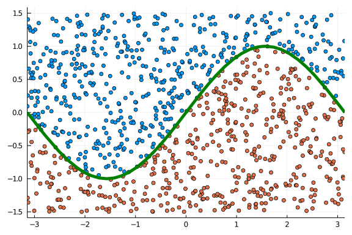
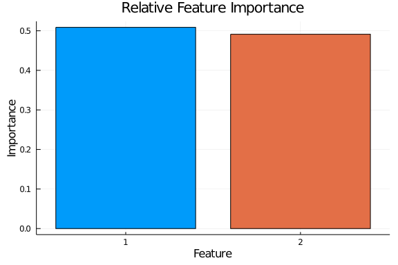

# DeepForest on a Toy Dataset

Here we set up the dataset (a sin curve) and initialize the model

```julia
using DeepForest, Flux, ProgressMeter, Plots, StatsPlots
using StatsBase: mode, mean
gr(fmt=:svg, size=(1500, 1000))

x = rand(Float32, 2, 1000);
x[1, :] .*= 2*π;
x[1, :] .-= π;
x[2, :] .*= 3;
x[2, :] .-= 1.5;
y = Int64.(x[2, :] .< sin.(x[1, :])) .+ 1;

model = Forest(25, 2, 10, 2, 1.0)
```


Now we train

```julia
forest_train!(2500, model, x, y)
```


Observe the results.

```julia
ŷ = predict(model, x);
@show mean(ŷ .== y)
scatter(x[1, :], x[2, :], color=ŷ, legend=false)
plot!((x) -> sin(x), xlims=(-π, π), color=:green, linewidth=5)
```

```
mean(ŷ .== y) = 0.993
```





We can also compute importances.

```julia
imp = importance(model, x)
plot_importance(imp, y)
```


