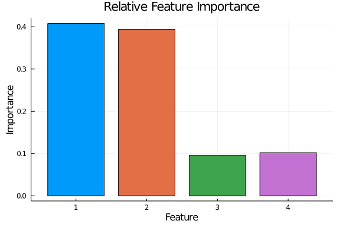

# DeepForest on a Iris Dataset

Here we set up the dataset (iris) and initialize the model

```julia
using DeepForest, Flux, ProgressMeter, Plots, StatsPlots, Random
using StatsBase: mode, mean
gr(fmt=:svg, size=(1500, 1000))

x = Float32.(Flux.Data.Iris.features())
lab = Flux.Data.Iris.labels();
y_unique = unique(lab)
mapping = Dict()
for i in 1:length(y_unique)
    mapping[y_unique[i]] = i
end

y = rand(Int, length(lab))
for i in 1:length(y)
    y[i] = mapping[lab[i]]
end

y = Int.(y)
perm = shuffle(Array(1:size(x, 2)))
x = x[:, perm]
y = y[perm]

model = Forest(100, 2, 10, 4, 0.5)
```


Now we train

```julia
forest_train!(1000, model, x, y)
```


Observe the results.

```julia
ŷ = predict(model, x);
@show mean(ŷ .== y)
```

```
mean(ŷ .== y) = 0.6666666666666666
0.6666666666666666
```


We can also compute importances.

```julia
imp = importance(model, x)
plot_importance(imp, x)
```


