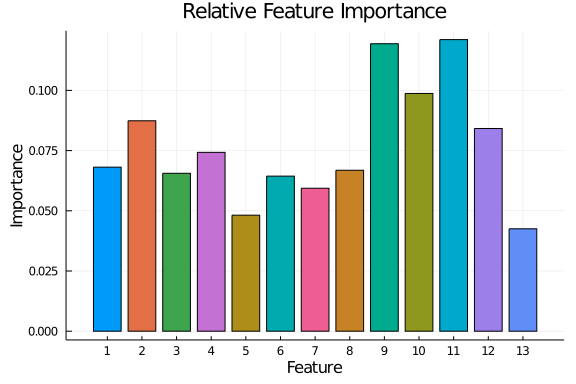

# DeepForest on a Wine Dataset

Here we set up the dataset (wine) and initialize the model

```julia
using DeepForest, Flux, ProgressMeter, Plots, StatsPlots, Random, CSV, DataFrames
using StatsBase: mode, mean
gr(fmt=:svg, size=(1500, 1000))

data = CSV.File("wine.data") |> DataFrame |> Array |> transpose |> Array
x = Float32.(data[2:end, :])
y = Int.(data[1, :])

perm = shuffle(Array(1:size(x, 2)))
x = x[:, perm]
y = y[perm]
```


Now we train

```julia
model = Forest(100, 2, 10, 13, 0.25)
forest_train!(5000, model, x, y)
```


Observe the results.

```julia
ŷ = predict(model, x);
@show mean(ŷ .== y)
```

```
mean(ŷ .== y) = 1.0
1.0
```


We can also compute importances.

```julia
imp = importance(model, x)
plot_importance(imp, x)
```


